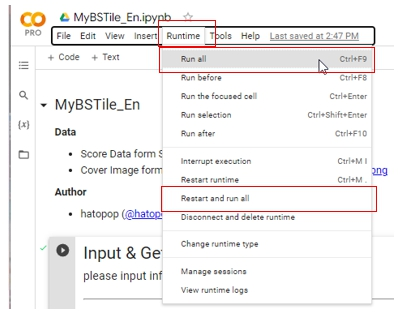

# MyBSTile
ScoreSaberのプレイ履歴データのタイル表示を行う[Google Colab Notebook](https://colab.research.google.com/github/hatopopvr/MyBSTile/blob/main/MyBSTile_En.ipynb) です。
MyBeatSaberAnalyticsに実装した機能の抜粋であり、データ取得量を減らしたライト版です。

## 使い方

1. [notebook](https://colab.research.google.com/github/hatopopvr/MyBSTile/blob/main/MyBSTile_En.ipynb) を開き、以下の情報を入力します。
 - `player_id` : ScoreSaberのPlayerIDを入力してください。 
 - `view_score_type` : 取得する内容を`top` か`recent`か選択してください。 
 

 
2. Press the `Runtime` tab, then Press the `Run All` or `Restart and Run All` button to get the results.

## データ元
- Score Data form ScoreSaber Public API - [doc](https://docs.scoresaber.com/)  
- Cover Image form - https://cdn.scoresaber.com/covers/{hash}.png  

## 作者
- hatopop ([@hatopop_vr](https://twitter.com/hatopop_vr))
