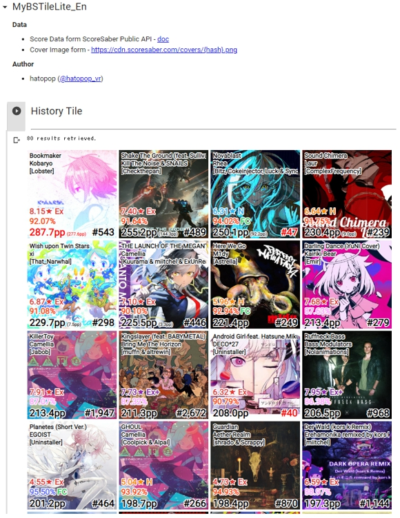
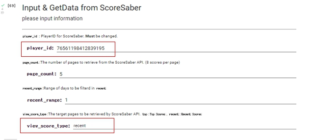
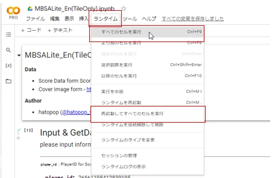

# MyBSTile
ScoreSaberのプレイ履歴データのタイル表示を行う[Google Colab Notebook](https://colab.research.google.com/github/hatopopvr/MyBSTile/blob/main/MyBSTile_En.ipynb) です。  
[MyBeatSaberAnalytics](https://github.com/hatopopvr/MyBeatSaberAnalytics)に実装した機能の抜粋であり、データ取得量を減らした超ライト版です。   
データ保存等も廃しているため、現在データの蓄積を想定する場合はMyBeatSaberAnalyticsを使用してください。

## 使い方

1. [notebook](https://colab.research.google.com/github/hatopopvr/MyBSTile/blob/main/MyBSTile_En.ipynb) を開き、以下の情報を入力します。
 - `player_id` : ScoreSaberのPlayerIDを入力してください。 
 - `view_score_type` : 取得する内容を`top` か`recent`か選択してください。 
 

 
2. `ランタイム`タブを選択し、 `すべてのセルを実行`か `再起動してすべてのセルを実行` を選択し、実行すると結果が得られます。

## データ元
- Score Data form ScoreSaber Public API - [doc](https://docs.scoresaber.com/)  
- Cover Image form - https://cdn.scoresaber.com/covers/{hash}.png  

## 作者
- hatopop ([@hatopop_vr](https://twitter.com/hatopop_vr))
